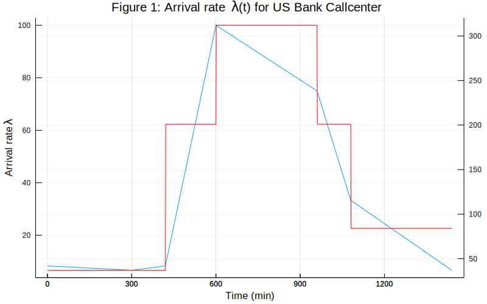
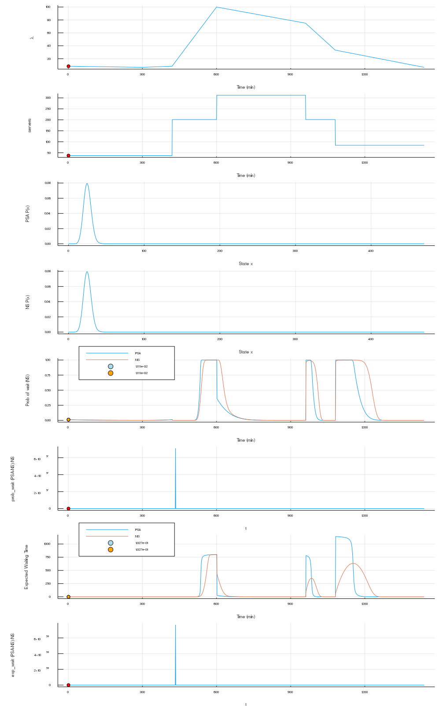
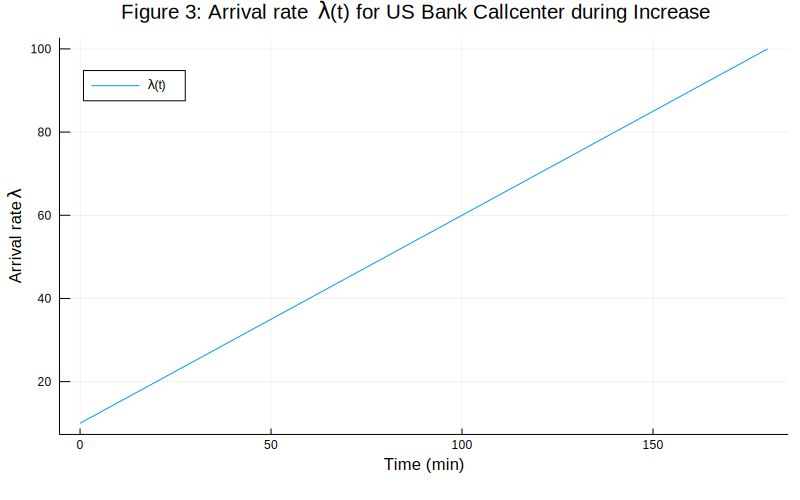
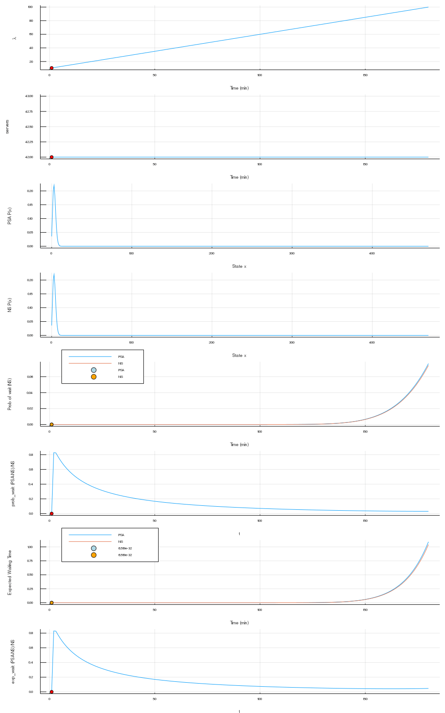
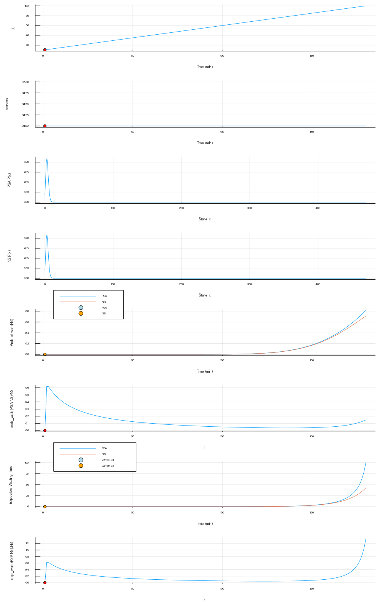
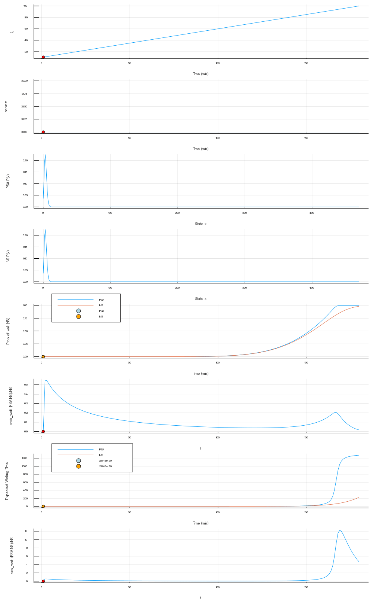

<!-- <script type="text/javascript" async
  src="https://cdnjs.cloudflare.com/ajax/libs/mathjax/2.7.5/MathJax.js?config=TeX-MML-AM_CHTML">
</script> -->

<script type="text/x-mathjax-config">
  MathJax.Hub.Config({
    tex2jax: {
      inlineMath: [ ['$','$'], ["\\(","\\)"] ],
      processEscapes: true
    }
  });
</script>

<script type="text/javascript"
    src="http://cdn.mathjax.org/mathjax/latest/MathJax.js?config=TeX-AMS-MML_HTMLorMML">
</script>


# Analysis of PSA vs. NS Methods 

In this notebook, we explore the differences between PSA and NS for computing performance measures on Markov chains. We begin by looking at the US Bank Callcenter model. 
## US Bank Callcenter Model


The US Bank Callcenter model is an M(t)/M/N(t) queue where the birth-rate $\lambda(t)$ and the number of servers $s(t)$ are piecewise linear and piecewise constant, over the same partition, respectively. Furthemore, $N(t)$ follows a square-root staffing model: if the average value of $\lambda(t)$ in segment $i$ is $\lambda_i$, then $s(t)=s_i$ on that segment with
$$
s_i  = \frac{\lambda_i}{\mu} + 3\sqrt{\frac{\lambda_i}{\mu}}.
$$

We show $\lambda(t)$ and $s(t)$ on a double axis plot in Figure 1 below.


```julia 


t = 1:1:1440
lambdas = US_Bank_Lambda(t)
println()
plot(t,lambdas, label = "\\lambda (t)", title = "Figure 1: Arrival rate \\lambda (t) for US Bank Callcenter", xlabel="Time (min)", ylabel="Arrival rate \\lambda", size =(800,500), legend = false)
plt = twinx()
plot!(plt, US_Bank_Servers(t), color=:red, ylabel="Number of Servers", legend = false)


```





Observe that during maximum load, we have that $\frac{\lambda(t)}{\mu}\approx 300$ and hence, we choose a waiting room of size $ S =300 + 10\sqrt{300}\approx 470$. In other words, the state space is $\mathcal{S} = \\{0,1,...,470\\}$.


We start by computing the non-stationary time evolution versus the stationary time evolution of the measures. For the NS model, we assume that we start at time 0 at the stationary distribution of Q(0), so that the methods coincide at time 0. 


```julia
t_f = 1440.0
delta_t = 1
num_sols = Int(t_f/delta_t)
p = Dict("forwards" => true)
S = 470
u_0 = bd_stat(US_Bank_Q(0))
prob = ODEProblem(US_Bank_dudt, u_0, (0.0, t_f),p)
NS_sol = solve(prob, CVODE_BDF(), reltol=1e-14, abstol=1e-14, saveat=delta_t)
PSA_sol = zeros(S+1,num_sols)
for i in range(1,stop=num_sols)
    PSA_sol[:,i] = get_stat_dist_Q(US_Bank_Q(NS_sol.t[i]))
end

```

In the following cell we compute some performance measures. In particular, we plot the probability-of-waiting, expected number waiting, and mean waiting time. The probability of waiting corresponds to the reward function
$$
r(x) = I(x>s(t)).
$$
The expected number waiting corresponds to
$$
r(x) = [x-s(t)]^+.
$$

The mean waiting time corresponds to
$$
r(x) = \frac{[x-s(t)]^+}{\mu}.
$$


```julia
# The first index corresponds to 
prob_of_wait = zeros(num_sols,2);
exp_num_wait = zeros(num_sols,2);
for i in range(1,stop=num_sols)
    prob_of_wait[i,1]  = PSA_sol[:,i]' * prob_of_wait_r(US_Bank_S, US_Bank_Servers(NS_sol.t[i]))
    prob_of_wait[i,2]  = NS_sol[i]' * prob_of_wait_r(US_Bank_S, US_Bank_Servers(NS_sol.t[i]))
    
    exp_num_wait[i,1] = PSA_sol[:,i]' * number_waiting_r(US_Bank_S, US_Bank_Servers(NS_sol.t[i]))
    exp_num_wait[i,2] = NS_sol[:,i]' * number_waiting_r(US_Bank_S, US_Bank_Servers(NS_sol.t[i]))        
end

```


<!-- ```julia
# To make gif interactive: change @gif to @manpiulate and comment out "every 1" at the end.

t = 1:1:1440
states = 0:1:S
lambdas = US_Bank_Lambda(t)
servers = US_Bank_Servers(t)
anim = @gif for t_now=1:1:1400
    p1 = plot(t,lambdas, label="\\lambda (t)", xlabel="Time (min)", ylabel="\\lambda(t)",legend=false)
    plot!([t_now],[US_Bank_Lambda(t_now)],color="red", seriestype=:scatter, label="t")
    p2 = plot(t,servers, xlabel="Time (min)", ylabel="servers")
    plot!([t_now],[US_Bank_Servers(t_now)],color="red", seriestype=:scatter,legend=false)
    p3 = plot(states, PSA_sol[:,t_now],xlabel="State x",ylabel="PSA P(x)",label="PSA",legend=false)
    p4 = plot(states, NS_sol[:,t_now], xlabel="State x",ylabel= "NS P(x)",label="NS",legend=false)
    
    # Performance Measures
    # Loss Prob
    p5 = plot([t,t], prob_of_wait[:,:],xlabel="Time (min)", ylabel="Prob of wait (NS)",label = ["PSA","NS"])
    names_5 = ["$(@sprintf("%.3e", (prob_of_wait[t_now,1])))","$(@sprintf("%.3e", (prob_of_wait[t_now,2])))"]
    plot!([t_now],[prob_of_wait[t_now,1]], color="lightblue", seriestype=:scatter, label = ["PSA","NS",names_5[1]])
    plot!([t_now],[prob_of_wait[t_now,2]], color="orange", seriestype=:scatter, label = ["PSA","NS",names_5[1],names_5[2]], legend =:bottomleft)
    
    p6 = plot([t],((prob_of_wait[:,1]-prob_of_wait[:,2])./prob_of_wait[:,2]), ylabel ="prob_wait: (PSA-NS)/NS", xlabel="t")
    plot!([t_now],[((prob_of_wait[t_now,1]-prob_of_wait[t_now,2])./prob_of_wait[t_now,2])], color="red", 
        seriestype=:scatter,left_margin = 10PlotMeasures.mm, label ="t", legend =false) 
        
    # Exp Wait Time
    p7 = plot([t,t], 3*exp_num_wait[:,:],xlabel="Time (min)", ylabel="Expected Waiting Time",label = ["PSA","NS"],legend =:bottomleft)
    names_7 = ["$(@sprintf("%.3e", (3*exp_num_wait[t_now,1])))","$(@sprintf("%.3e", (3*exp_num_wait[t_now,2])))"]
    plot!([t_now],[3*exp_num_wait[t_now,1]], color="lightblue", label=names_7[1], seriestype=:scatter)
    plot!([t_now],[3*exp_num_wait[t_now,2]], color="orange", seriestype=:scatter, label=names_7[2])
    
    p8 = plot([t],((exp_num_wait[:,1]-exp_num_wait[:,2])./exp_num_wait[:,2]), ylabel ="exp_wait: (PSA-NS)/NS", xlabel="t", left_margin = 10PlotMeasures.mm)
    plot!([t_now],[((exp_num_wait[t_now,1]-exp_num_wait[t_now,2])./exp_num_wait[t_now,2])], color="red", seriestype=:scatter, label ="t", legend =false)
    
    plot(p1,p2,p3,p4,p5,p6,p7,p8, layout = (8,1),size =(1000,1600))
    
    end  every 10

``` -->





# Fast Rise Time

We now investigate the discrepancy of PSA and NS when $\lambda(t)$ increases the fastest for varying choices of constant $s(t)=s$. From the US Callcenter data, we see that during the period of fastest increase, $\lambda(t)$ ranges from approximately $~50/6 = 8.3$ to $100$ from time $t=420$ to $t=600$. (This can be confirmed in Figure 1 above.) In other words, in the span of three hours, $\lambda(t)$ increases by about 90. 

Here we consider only the ramp up period going from $\lambda=10$ to $\lambda =100$ in 180 minutes. We keep $\mu=1/3$ and keep the number of servers stationary so that
$\rho_{\max} = \rho(180)$ varies in $\\{.8,.9,1.1\\}$. 





### $\rho=0.8$ 



### $\rho=0.99$ 



### $\rho=1.1$ 



