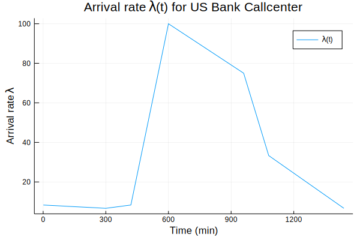
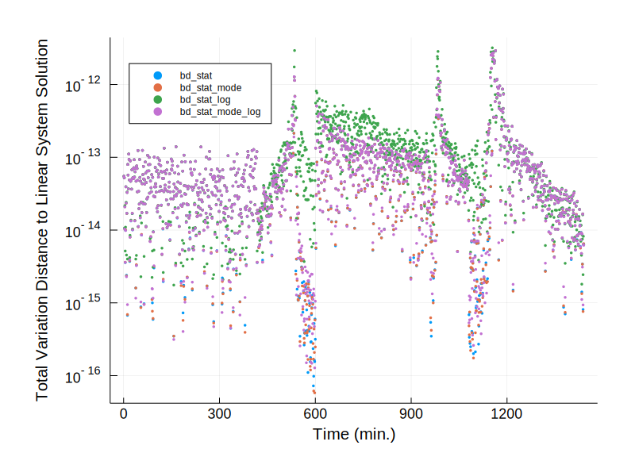
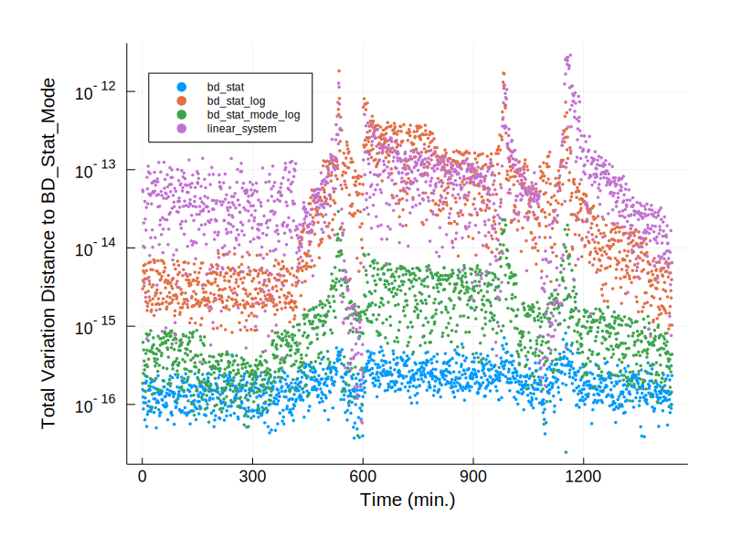

```julia
using LinearAlgebra
using SparseArrays
using DifferentialEquations
using Statistics
using Sundials
using DataStructures
using Plots; gr(guidefontsize=14, legendfontsize=8, legend=false,size = (800,600), margin = 10PlotMeasures.mm, tickfontsize = 12)
using Plots.PlotMeasures
using Distributions
include("../functions/MC_functions.jl")
```


    number_waiting_r (generic function with 1 method)


# Stationary Distribution Calculations 

This notebook is dedicated to the analysis of stationary distribution calculations in various contexts of interests. We will begin by looking at the US Bank Callcenter model. We will consider four different methods in this notebook. 

#### 1. Birth death 

The birth death method sets $\pi(0)=1$ and computes
$$
\begin{align}
\pi(i+1) = \frac{\lambda(i)}{\mu(i+1)} \pi(i).
\end{align}
$$
for $i=\{0,1...S-1\}$. And then normalizes $\pi$ to sum to one. 
#### 2. Birth death chains starting at mode

This method assumes the stationary distribution has a single mode. It computes the mode by finding the first index $i$ wherein $\lambda(i)/\mu(i+1)<1$ and chooses $i$ to be the mode. Call this mode $i^*$. Then it sets $\pi(i^*)=1$ and recursively computes
$$
\pi(i+1) = \frac{\lambda(i)}{\mu(i+1)} \pi(i)
$$
for $i=i^*,i^*+1,...S-1$. And then recursively computes
$$
\pi(i-1) = \frac{\mu(i)}{\lambda(i-1)} \pi(i)
$$
for $i=i^*, i^*-1, ... 1$.

#### 3. Birth death (log-exp)

This sets $\ell(0)=log(\pi(0))=0$ and then recursively computes

$$
\begin{align}
\ell(i+1)\log(\pi(i+1)) = \log(\lambda(i))-\log(\mu(i+1))+\log(\pi(i)) = \log(\lambda(i))-\log(\mu(i+1))+\ell(i).
\end{align}
$$

and then exponentiates elementwise to compute $\pi = exp(\ell)$ and normalizes $\pi$ to sum to one. 


#### 4. Birth death chains starting at mode (log-exp)
This implements both the ideas in (2) and (3) at once.

#### 5. Linear System Approach

Suppose $W=Q^T$ has block form
$$
\begin{pmatrix}
B & d\\
t^T & \alpha
\end{pmatrix}.
$$
We solve the system 
$$
Bw=-d.
$$
(The invertibility of $B$ is guaranteed by the irreducibility of $Q$.) Then we set $\pi=(w,1)$ and normalize. 


```julia
dict_of_solvers = OrderedDict{}()
dict_of_solvers["bd_stat         "] = Dict(); 
dict_of_solvers["bd_stat         "]["func"] = bd_stat

dict_of_solvers["bd_stat_mode    "] = Dict()
dict_of_solvers["bd_stat_mode    "]["func"] = bd_stat_mode

dict_of_solvers["bd_stat_log     "] = Dict()
dict_of_solvers["bd_stat_log     "]["func"]= bd_stat_log

dict_of_solvers["bd_stat_mode_log"] = Dict()
dict_of_solvers["bd_stat_mode_log"]["func"] = bd_stat_mode_log

dict_of_solvers["linear_system   "] = Dict()
dict_of_solvers["linear_system   "]["func"] = get_stat_dist_Q
```


    get_stat_dist_Q (generic function with 1 method)


# Infinite Server Queue Approximation

We start with a small example. Let $\lambda =\mu =1$ and $s=S=10$. According to square-root staffing, this is about ten deviations out. Hence this is a good approximation to the infinite server model. We will want to see whether the stationary distribution solvers coincide to the known true distribution for the infinite server model:


```julia
p = Dict("s"=> 10, "S"=> 10, "sin_base" => 1, "sin_rel_amp" => 0, "sin_rate"=>0, "phase_shift" =>0, "mu"=>1, "lambda_func_type"=> "sinusoidal");
Q = (Finite_Server_Q(0,p))
```


    11×11 Tridiagonal{Float64,Array{Float64,1}}:
     -1.0   1.0    ⋅     ⋅     ⋅     ⋅     ⋅     ⋅     ⋅      ⋅      ⋅ 
      1.0  -2.0   2.0    ⋅     ⋅     ⋅     ⋅     ⋅     ⋅      ⋅      ⋅ 
       ⋅    1.0  -3.0   3.0    ⋅     ⋅     ⋅     ⋅     ⋅      ⋅      ⋅ 
       ⋅     ⋅    1.0  -4.0   4.0    ⋅     ⋅     ⋅     ⋅      ⋅      ⋅ 
       ⋅     ⋅     ⋅    1.0  -5.0   5.0    ⋅     ⋅     ⋅      ⋅      ⋅ 
       ⋅     ⋅     ⋅     ⋅    1.0  -6.0   6.0    ⋅     ⋅      ⋅      ⋅ 
       ⋅     ⋅     ⋅     ⋅     ⋅    1.0  -7.0   7.0    ⋅      ⋅      ⋅ 
       ⋅     ⋅     ⋅     ⋅     ⋅     ⋅    1.0  -8.0   8.0     ⋅      ⋅ 
       ⋅     ⋅     ⋅     ⋅     ⋅     ⋅     ⋅    1.0  -9.0    9.0     ⋅ 
       ⋅     ⋅     ⋅     ⋅     ⋅     ⋅     ⋅     ⋅    1.0  -10.0   10.0
       ⋅     ⋅     ⋅     ⋅     ⋅     ⋅     ⋅     ⋅     ⋅     1.0  -10.0


```julia
for (key, value) in dict_of_solvers
    func = value["func"]
    print(key)
    print(":    ")
    if func(Q) == -1
        print("Fail")
    else
        print("Success")
        value["stat"] = func(Q)
    end
    println()
end
```

    bd_stat         :    Success
    bd_stat_mode    :    Success
    bd_stat_log     :    Success
    bd_stat_mode_log:    Success
    linear_system   :    Success


```julia
ref_statdist = pdf.(Poisson(),0:1:10)

for (key, value) in dict_of_solvers
    print(key); print(":   ")
    if "stat" in keys(value)
        print(maximum(abs.(value["stat"]-ref_statdist)))
        println()
    else
        print("N/A")
        println()
    end
end
```

    bd_stat         :   3.6963667127132283e-9
    bd_stat_mode    :   3.6963667127132283e-9
    bd_stat_log     :   3.6963667127132283e-9
    bd_stat_mode_log:   3.6963667127132283e-9
    linear_system   :   3.6963667127132283e-9


The fact that they all differ by the infinite server approximation by the same amount to so many digits shows that the error is dominated by the infinite server approximation. But this code suggests the stationary distribution calculations are working correctly.


# US Callcenter Model

In this notebook, we aim to see how well various solvers work on computing the stationary distribution for the US callcenter model. In this model, we have the following $\lambda(t)$ values.


```julia
t = 1:1:1440
lambdas = US_Bank_Lambda(t)
plot(t,lambdas, label = "\\lambda (t)", title = "Arrival rate \\lambda (t) for US Bank Callcenter", xlabel="Time (min)", ylabel="Arrival rate \\lambda")
```





As observed $\lambda(t)$ ranges from 0 to 100 customers per minute throughout the day. The mean service time is 3 minutes. We assume a square-root staffing model where for the $i$'th piecewise linear segment the staffer uses the average value of $\lambda(t)$, call it $\lambda_i$, to define $\rho_i$ and sets 

$$
s_i  = \rho_i + 3\sqrt{\rho_i}.
$$

Observe that during maximum load, we have that $\rho(t)\approx 300$ and hence, we choose a state space $ S =300 + 10\sqrt{300}\approx 470$. 


```julia
t_f = 1440.0
delta_t = 1
num_sols = Int(t_f/delta_t)

for (key, value) in dict_of_solvers
    PSA_sol = zeros(US_Bank_S+1,num_sols)
    for i in range(1,stop=num_sols)
        PSA_sol[:,i] = value["func"](US_Bank_Q(i))
    end
    value["PSA_sol"] = PSA_sol
end

```


```julia
t = 1:1:1440
list_of_plots = []
tmp = sum(abs.(dict_of_solvers["linear_system   "]["PSA_sol"] - dict_of_solvers["linear_system   "]["PSA_sol"]), dims = 1)
plt = plot(legend =:topleft, yscale = :log, xlabel = "Time (min.)", ylabel="Total Variation Distance to Linear System Solution")
for (key, value) in dict_of_solvers
    if key == "linear_system   "
        continue
    end
    errs = sum(abs.(value["PSA_sol"] - dict_of_solvers["linear_system   "]["PSA_sol"]), dims=1)
    value["plot"] = plot!(t,errs', label =key, seriestype=:scatter, markersize =2, markerstrokealpha=0)
end
display(plt)
```





```julia
t = 1:1:1440
list_of_plots = []
tmp = sum(abs.(dict_of_solvers["bd_stat_mode    "]["PSA_sol"] - dict_of_solvers["bd_stat_mode    "]["PSA_sol"]), dims = 1)
plt = plot(legend =:topleft, yscale = :log, xlabel = "Time (min.)", ylabel="Total Variation Distance to BD_Stat_Mode")
for (key, value) in dict_of_solvers
    if key == "bd_stat_mode    "
        continue
    end
    errs = sum(abs.(value["PSA_sol"] - dict_of_solvers["bd_stat_mode    "]["PSA_sol"]), dims=1)
    value["plot"] = plot!(t,errs', label =key, seriestype=:scatter, markersize =2, markerstrokealpha=0)
end
display(plt)
```





# Computing the stationary distribution at peak load

We are interested in comparing different numerical methods for computing the stationary distribution at peak load. We will compare the following methods

1. Birth death standard (pi(i) = lambda_{i-1}/mu_i pi(i-1) with pi(0)=1).
2. Birth death starting at mode.
3. Birth death with log-exp.
4. Birth death starting at mode with log-exp.

Let's first have a look and see if all methods even compute sensible numbers. Let's have a look at $t=600$ and $t=900$, which correspond to times of over-saturation and under-saturation respectively, both during peak arrival rates.


```julia
for (key, value) in dict_of_solvers
    func = value["func"]
    print(key)
    print(":    ")
    if func(US_Bank_Q(600)) == -1
        print("Fail")
    else
        print("Success")
        value["stat_600"] = func(US_Bank_Q(600))
    end
    println()
end
```

    bd_stat         :    Success
    bd_stat_mode    :    Success
    bd_stat_log     :    Success
    bd_stat_mode_log:    Success
    linear_system   :    Success


So only bd_stat_log failed, it seems like. Let's check to see if the other ones have similar values for the stationary distribution.


```julia
ref_statdist = dict_of_solvers["bd_stat         "]["stat_600"]

for (key, value) in dict_of_solvers
    print(key); print(":   ")
    if "stat_600" in keys(value)
        print(maximum(abs.(value["stat_600"]-ref_statdist)))
        println()
    else
        print("N/A")
        println()
    end
end
```

    bd_stat         :   0.0
    bd_stat_mode    :   5.551115123125783e-17
    bd_stat_log     :   2.4091839634365897e-14
    bd_stat_mode_log:   2.220446049250313e-16


```julia
US_Bank_Q()
```
